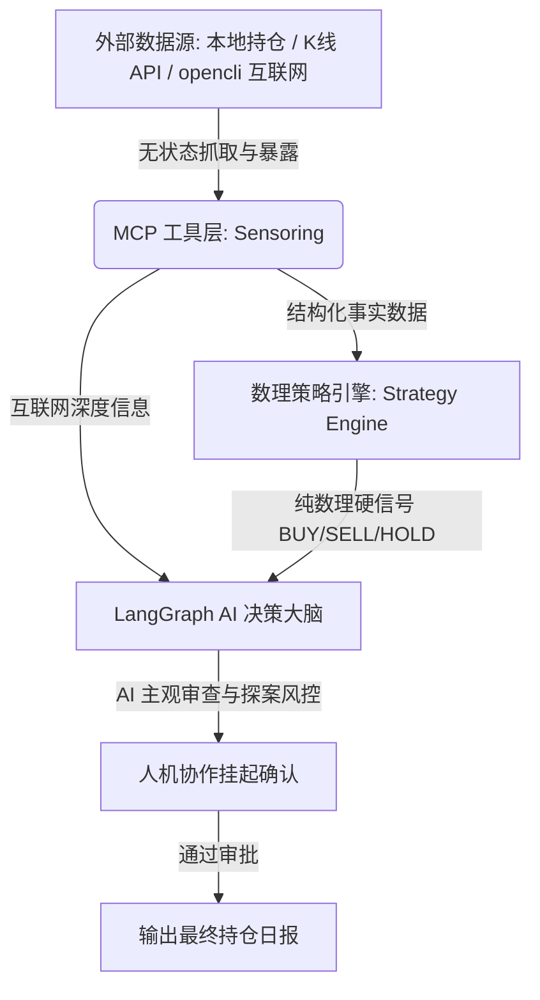

# MCP 工具定位与能力蓝图设计说明书

本说明书用于深入探讨和明确 **MCP (Model Context Protocol) 服务的定位、职责边界以及在此架构下各项能力的具体划分**。这是为了确保我们从脆弱的单体脚本向“解耦、健壮、可扩展的 Agent 架构”演进时，有清晰的理论依据与实现指导。

---

## 一、 为什么引入 MCP？它的核心定位是什么？

在 LLM 应用中，大语言模型（LLM）本身是一个“缸中之脑”，它拥有极强的推理和关联能力，但**缺乏物理世界的接口**：
1. 它不知道当下你的账户持仓事实；
2. 它无法实时拉取今日的股票 K 线并计算统计指标；
3. 它无法在黑天鹅事件发生时去互联网（雪球、东财、新浪财经）检索实时资讯。

**MCP 服务，就是 LLM 连接物理世界的“感官（传感器）”与“手臂（执行器）”。**

### 1. MCP 的核心定位
* **定位**：**无状态、高可靠、确定性的数据供给与物理执行层**。
* **物理原则**：MCP 只负责“诚实地获取数据”与“原样地执行物理操作”，**绝不掺杂任何 AI 主观推理或复杂业务决策**。
* **输入/输出特征**：强类型约束、高确定性。即无论 AI 调用多少次，在相同外部数据源下，MCP 返回的都是一致的结构化事实。

### 2. 职责隔离：什么不属于 MCP？
为了防止项目重构时重蹈“打补丁、逻辑混乱”的覆辙，我们对以下三个层次进行了严格的物理与逻辑隔离：



* **数理策略引擎 (Strategy Engine) $\neq$ MCP**：
  网格交易计算、红利对冲股息率比较等属于**强数理确定性的规则引擎**。它直接消费 MCP 提供的 K 线与账户数据，在纯 Python 逻辑中执行计算并输出物理硬信号。它不需要 AI 参与，也不应该和 MCP 服务混为一谈。
* **AI 决策与探案逻辑 (LangGraph Nodes) $\neq$ MCP**：
  是否因为 $Z-Score \ge 2.0$ 判定异常而需要启动“深度探案”？如何提炼雪球上的舆情新闻？这些主观关联与流程控制（Graph Workflow）由 **LangGraph** 的节点和边执行。MCP 不知道这些流程，它只被动地接受 Agent 的调用（如被动接受“搜索某股票近期新闻”的指令）。

---

## 二、 现有 MCP 工具能力分析 (能实现哪些)

根据对源码 `src/stock_assistant/agents/agent_tools.py` 的剖析，现有的 MCP 服务已经构建了极好的“物理世界感官”。以下是当前已具备的底层物理能力：

| 现有 MCP 工具名称 | 对应底层物理能力与实现细节 | 它提供了什么事实数据？ |
| :--- | :--- | :--- |
| `stock_get_current_holdings` | 读取本地 `AgentWorkspace` 持仓数据并标准化。 | 账户内所有标的的 `code`、`name`、`market_value`、`profit_pct` 等。 |
| `stock_get_portfolio_profile` | 从工作区提取账户组合的多维画像（资产大类、地域、主题等）。 | 行业/地域/主题分布比例，帮助 AI 掌握大局观。 |
| `stock_get_holding_technical` | 调用底层行情 API 获取标的 120 日历史 K 线并计算移动平均线等指标。 | `ma20`、`ma60`、`ma120`、`rsi14`、日收益率波动率、距高点回撤等。 |
| `stock_get_classification` | 获取标的的分类打标情况。 | 辅助大局观分析。 |
| `stock_load_snapshot_summary` | 读取上一次生成的历史日报快照。 | 获得历史上下文对比。 |
| `stock_compare_snapshots` | 物理对比当前事实数据与历史快照的变动情况。 | 自动生成变动差异（如新增仓位、仓位比例大幅变动）。 |
| `stock_web_search` | **深度探案核心**：并发拆分查询，联动 opencli 抓取多个标的并支持 `auto_read`（自动读取 top1 的页面正文）。 | 互联网搜索结果，自动去噪，甚至自动抓取正文翻译为 Markdown。 |
| `stock_web_read` | 精准读取特定 URL 的网页内容，并判定网页质量（如是否被拦截登录页）。 | 干净的 Markdown 格式页面正文。 |
| `stock_opencli_command` | 直通 `opencli` 的高级底座，支持对东财、雪球等渠道的特化命令。 | 比如查公告、看特定K线数据、看雪球热股舆情。 |

---

## 三、 要实现哪些新能力 (MCP 统计学与维度增强)

为了配合接下来的 **LangGraph 探案流** 以及 **数理策略引擎**，MCP 需要在现有能力上进行两项重大的**统计学与信息穿透补强**：

### 1. 动态 $2\sigma$ 标准差与 $Z-Score$ 的计算与暴露 (修改 `get_technical`)
* **痛点**：目前的技术指标都是 MA 均线或死数回撤（如跌12%），这不符合根据个股自身波动动态预警的原则。
* **要实现的能力**：
  * 在 `analyze_one` 服务中，拉取 120 天收盘价，计算日收益率序列：$R_t = \frac{Close_t - Close_{t-1}}{Close_{t-1}}$。
  * 使用 `statistics.pstdev` 算这 120 天日收益率的总体标准差（$\sigma_{120}$）以及均值（$\mu_{120}$）。
  * 计算今日收益率相对均值的离散倍数：$Z-Score = \frac{R_{today} - \mu_{120}}{\sigma_{120}}$。
  * 计算异常偏离信号：如果 $|Z-Score| \ge 2.0$，判定此标的为今日异常变动（今日跌/涨幅超出了 120 天内 $95\%$ 的日常概率区间），标记 `is_abnormal_deviation = True`。
  * **在 MCP 返回结果中暴露**：`volatility_120` ($\sigma$)、`z_score`、`is_abnormal_deviation`。

### 2. 新增 ETF 穿透工具：`stock_get_etf_constituents` (官方原生与双轨容灾)
* **痛点（用户核心痛点）**：
  同花顺投资账本返回的“持仓明细”仅停留在 ETF 基金这一层（如：证券 ETF 512880），但在实际市场中，ETF 只是一个被动的资产容器。
  用户真正的痛点在于：**这只 ETF 里面包含的到底有哪些股票（底层成分股明细）**？如果不知道底层个股及重叠情况，策略引擎就无法准确审计红利对冲与网格配置的行业暴露与个股集中度，AI 决策大脑也无法对底层的黑天鹅风险（如某权重股突然停牌或跌停）做出“吹哨人”预警。
* **要实现的能力**：
  * **定位**：无状态的底层股票穿透传感器。
  * **输入参数**：ETF/基金的 6 位数字代码（如 `512880`）。
  * **底层物理接口**：**双轨穿透机制**。优先请求同花顺官方原生穿透接口 `/caishen_fund/fund_quota/v1/heavy_held_stock`，获取极速高保真重仓个股；当官方接口不可用时，自动降级请求天天基金公开接口 `https://fundf10.eastmoney.com/FundArchivesDatas.aspx?type=jjcc&code={code}&topline=10`。
  * **输出数据结构**：包含底层成分股的股票代码与股票名称列表。
    ```json
    {
      "code": "512880",
      "constituents": [
        { "code": "600030", "name": "中信证券" },
        { "code": "601377", "name": "兴业证券" },
        { "code": "601688", "name": "华泰证券" }
      ],
      "count": 3
    }
    ```
  * **核心决策价值**：
    使得在设计 MCP 与 AI 图交互时，大脑不仅能在宏观上观察到“证券 ETF”，还能向下刺穿到其前十大权重股票（如“中信证券”），在底层个股面临异动或舆情负面时，提供精准的**“穿透式集中度风险审计”**。

### 3. 新增历史交易流水与资产趋势审计工具
* **痛点**：当前系统缺乏对历史交易行为的审计能力，AI 无法评估真实的买卖滑点、网格交易周转率以及整体资产的历史净值走势曲线。
* **要实现的能力**：
  * **`stock_get_trade_history`（历史交易流水传感器）**：
    * **入参**：`account_id` (即 `fund_key`)、`start_date`、`end_date`。
    * **物理接口**：同花顺原生股票交易流水接口 `/caishen_fund/stock_position/v1/stock_history_query` 和基金交易流水接口 `/caishen_fund/fund_quota/v1/trans_history`。
    * **输出**：特定时段内的真实买卖价格、买卖时间与成交份额列表。
    * **价值**：供策略回溯分析、计算真实网格利差与网格资金周转率。
  * **`stock_get_asset_trend`（资产历史净值趋势传感器）**：
    * **物理接口**：同花顺原生整体资产趋势接口 `/caishen_fund/pc/asset/v1/asset_trend`。
    * **输出**：账户历史总资产与净值序列，支持时间维度拉取。
    * **价值**：生成可视化的资产增长曲线与夏普比率等大盘绩效指标。

---

## 四、 核心架构总结：数据与指令的物理流向

1. **第一步（无状态事实感知）**：
   LangGraph Agent 的 `State` 初始化，调用 MCP 工具 `stock_get_current_holdings` 拿到持仓列表，并调用 `stock_get_holding_technical` 拿到所有标的的波动率指标。
2. **第二步（数理策略计算）**：
   策略引擎（Strategy Engine）读取这批无状态数据，套用纯数理的网格/红利算法，输出每个标的的硬信号（比如红利对冲：`BUY A, SELL B`）。
3. **第三步（异常评估与吹哨人判定）**：
   LangGraph 发现部分标的 `is_abnormal_deviation = True`。将它们推进“待调查队列”，启动深度探案。
4. **第四步（穿透与深度探案）**：
   针对每一个异常标的，AI 调用 `stock_get_etf_constituents` 查其权重股，再并发调用 `stock_web_search` 获取雪球/东财上有关权重股与 ETF 本身的最新大字报、突发新闻。
5. **第五步（AI 吹哨人风控标注）**：
   AI 评估策略引擎输出的硬信号，若发现虽然数理信号说“买入”（跌入网格区），但外部黑天鹅风险极高，AI 不擅自修改硬信号，而是**在旁边写下醒目的主观风控警告**。
6. **第六步（人机协作挂起）**：
   LangGraph 触发 `interrupt`，挂起整个图的流向，将草稿呈送给用户。

通过上述清晰的定位，我们的 MCP 彻底摆脱了复杂的“业务大杂烩”，成为了整个 ETF 决策系统里**最稳固、最纯粹的底层基石**。
